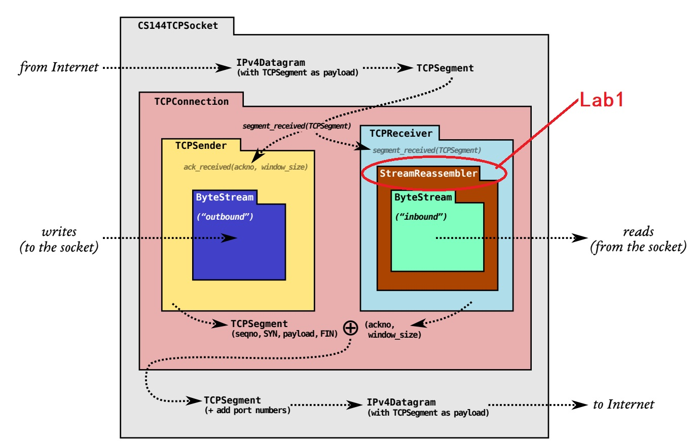
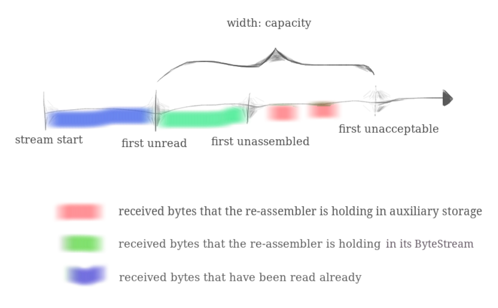
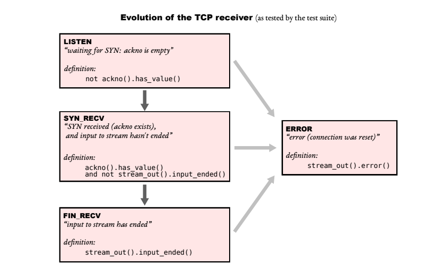
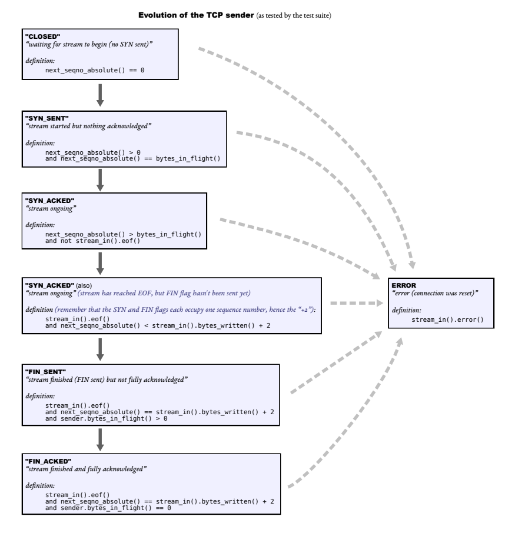
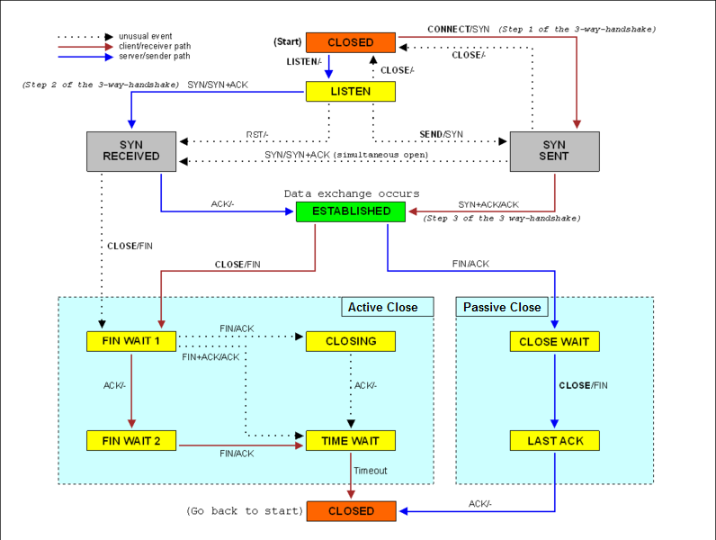

CS144/sponge 项目，实现TCP。

官网: [CS 144: Introduction to Computer Networking](https://cs144.github.io/)

先修课程: 数据结构、C++。

我之前没写过C++，所以学这个课之前去学了 [CS 106L](http://web.stanford.edu/class/cs106l/)。

> 如果没用过 cmake，强烈建议去学一下，只要了解最基础的概念即可。否则可能会不知道如何处理一些bug。

note: 一下所有经验，来源于我做的版本（2022-10左右），官方会不断更新，建议采用最新版。

这个仓库也有我做的这个版本的备份。

# setup env

参考官方文档即可: [Setting up your CS144 VM using VirtualBox (stanford.edu)](https://stanford.edu/class/cs144/vm_howto/vm-howto-image.html)

官方给了不同的方式配置环境：用自己的Linux安装各种包，或者用其提供的镜像文件在VirtualBox上运行。

我先用 wsl2 试了一下，没有成功。事实证明 使用镜像文件 是最省事的方案。（虽然需要下载大概1.5G。）

IDE 我用的 Clion，Cmake + Remote Deployment 同步文件和debug非常方便。 

我的具体做法：

- 下载 virtualbox、镜像文件
- 在 virtualbox 中加载镜像文件
- 配置 Ubuntu 系统：

  - 配置自己的dotFile
  - apt 换源
  - update cmake(可选): [Install Cmake · GitBook (uc3m.es)](https://robots.uc3m.es/installation-guides/install-cmake.html#install-cmake-319-ubuntu-1804-bionic)
  - 配置 github ssh（可选，可以在自己电脑上`git clone`, 再把文件同步到虚拟机）
- 克隆仓库到本地: `git clone git@github.com:CS144/sponge.git`
- 配置 Clion, 主要是设置目录映射和Cmake
  setting-“Build,Execution,Deployment”-Deployment
   设置 ssh连接、目录映射（本地`sponge`, 映射到 `/home/cs144/sponge`）


> 虚拟机内部网速慢的问题：
>
> [VirtualBox 虚拟机里网络很慢的解决方法 - Python List (pylist.com)](https://pylist.com/topic/175.html)
>
> 在安装VirtualBox安装目录中执行如下代码：
>
> ```bash
> ./VBoxManage.exe modifyvm cs144_vm --natdnshostresolver1 on 
> ./VBoxManage.exe modifyvm cs144_vm --natdnsproxy1 on
> ```
>
> 网速就和宿主机一样了。

## build

```bash
ssh -p 2222 cs144@localhost
cd sponge

mkdir build && cd build && cmake ..
# or cmake -B build
# 如果用的Clion没必要用这一步, Clion 会自动创建可执行目录,
# like: cmake-build-debug-remote-host

make -j4 #-j4 表示用 4个 processors make

# 写完代码后 test, 以lab0为例
make check_webget
make check_lab0
```

## debug

如果 `make check_labx` 没通过：

进入 `sponge/tests` 中，找到对应的测试文件，然后用 Clion debug。

可能有部分 test.cc 显示 `This file does not belong to any project;...`, 如 `tests/fsm_retx.cc`。

Solution: 去 `/tests/CmakeList.cmake` 添加 `add_test_exec (fsm_retx)` 即可。

（这就是为什么要学一点 Cmake）

在源文件下完断点后，就可debug。

## 实验总体结构



从 Lab1 到 Lab4，我们将会实现 TCP, 也就是 `TCPSocket`。如上图所示，`TCPSocket` 内部操作封装的 `TCPConnection`, 后者有操纵 `TCPSender` 和 `TCPReceiver`, 他们内部用到 `ByteStream` 这个数据结构。`TCPReceiver` 内部比 `TCPSender` 多了一个 `StreamReassembler` 用来缓存“后发先至”的 segment。

实任务是去补全这些类的核心方法。顺序是： `lab0:ByteStream` => `lab1:Reaasembler` => `lab2:Receiver` => `lab3:Sender` => `lab4:Connection`。

可以看到，是自底向上的。这样安排的好处是：在实现底层方法的时候，不用考虑其他层的事情，做好眼前的事即可。但也有其弊端：我们如果能知道上层会在何种场景调用，会对该方法有很好的理解，实现的思路更清晰。

事实是，我在实现某些方法时，并不能从`labx.pdf` 的描述中完全 get 到某个方法的作用是什么，**还有更多的信息和要求在test中**。这个课程的Test 设计得非常好，测试失败后，会一步步打印出实验的步骤和其预期的结果，引导我们改成正确的代码。

比如，在实现`Sender::fill_window()`前，我就有一些困惑：fill_widow() 是 fill 谁的 window？生成的 segment 需要发出去吗？别的方法需要调用`fill_window()` 吗？需要允许重复发送吗？

等到我实现 `TCPConnection`(`Sender` 的调用者) 时，我就完全清楚上面问题的答案了。但是，显然我们直接跳去 `lab4` 去理解这些也不太好。好在，CS144 为我们提供了**非常丰富**测试代码，考虑到了各种 corner case，这些测试可以帮我们完善我们的代码。

不过，这也是建立在自己已经写了大部分代码的情况下，如果一点思路都没有，完全没有 get 到某个方法的idea怎么办呢？：你可以来这里看看，这个短文会给出我自己在写代码前的**一些困惑和解答**、还有遇到的一些**微妙的bug**、和**一些完全没有必要遇到的TCP思想之外的问题**。

在解决这些问题的过程中，可以学到很多（比如Lab0的一些bug，逼我去学了 cmake）。但我也不得不承认，有些痛苦完全没必要经历一遍。所以我写下这个，希望可以给后来的同学解决一些坑，让其专注于TCP本身的复杂度，减少在lab之外（如搭建环境）所花费的时间（我认为自己debug花的时间有点多）。

本文并不能代替官方的 `labX.pdf`, 可以作为一个补充进行参考。自己解决的问题越多，对代码的理解也越多，成就感越强，所以，建议实在想不清楚时再看其他人的思路。

我在完成lab的过程中，也参考了别人的博客，但代码都是自己写的（尽管一开始有些丑陋:）。链接如下：

- [doraemonzzz](http://doraemonzzz.com/tags/CS144/)

- [Misaka's blog (misaka-9982.com)](https://www.misaka-9982.com/)
- [CS自学指南 (csdiy.wiki)](https://csdiy.wiki/)
- 参考链接的链接:-x

# Lab0 webget, ByteStream

[lab0.pdf (cs144.github.io)](https://cs144.github.io/assignments/lab0.pdf)

## 1 webget

**目标:** 调用系统 TCP库，写一个 wget like program. 这是一个`application` 层的应用。

**思路:** 

TCP 的 interface 叫 Socket。(Python 和 Java 中都有对应的包)

先去读`TCPSocket` 的文档，然后去实现 `sponge/apps/webget.c` 的 `get_URL()` 方法。

大概10行左右。

**测试:**

```bash
cd build
make -j4 && make check_webge
```


**可能遇到的Bug**:

如果提示g++等级不够：

```bash
sudo apt install g++-8
# the clean dir /build
cd /build && rm -rf ./*
CXX=g++-8 cmake ..
```


check_webget 可能报错：

- 如果是`BAD_COMMAND`, 是由于 win => linux 文件格式 或者 `.sh` 没有可执行权限:

  ```bash
  vim tests/webget_t.sh
  :set ff=unix
  ZZ
  
  # 加上x权限
  chmod +x sponge/tests/webget_t.sh
  ```

- 网速问题：虚拟机内部网速比宿主机慢。-> 见上面 setup env。

## 2 ByteStream

这个没有太多要注意的，仔细读官方提供的材料，选择一个合适的数据结构即可。

因为C++ 没有 `byte` type, 用 `char` 表示。

`eof` 和 `input_ended` 是两种状态。

# Lab1 Reaasembler

[lab1.pdf (cs144.github.io)](https://cs144.github.io/assignments/lab1.pdf)

> 注意: 课程并不是一开始提供整个代码框架，而是一点一点暴露。
>
> 切换到Lab2，应该用 `git merge`.

Reaasembler 是 Receiver 的一部分，用来缓存哪些后发先至的 segment。

在这里实现后，写Receiver时任务就少一些。

 

这张图很重要:



当 Receiver 收到 segment 之后，会传给 `Reassembler`, 由其进行顺序整理，讲有序 data 放入 `ByteStream`（上图中绿色的部分），顺序错乱的 data 放入 `Reassembler` 的 buffer 中保存。（红色的部分）。

如果 data 的 index，是已经在 `ByteStream` 中的(上图蓝的部分) 或 其 index 超过了 `Reassembler` 的容量（上图中 `first unacceptable` 之后的），那 `Reassembler` 就把他们丢弃。


`StreamReassembler`的核心方法是`push_substring(const string &data, const size_t index, const bool eof)`.

它的主要任务是：

- 根据 index，把`data`, 放入上图中的合适位置（可能丢弃）。

这也不太复杂，难点是 要假设：这些不能保证顺序的 data 可能会 互相重叠！这是我在 *Computer Networking A Top-Down Approach* 中，没有读到的。一开始我感到很奇怪，为什么 data 会重叠呢？

其实这个问题在 `rassembler` 中就体现了，如果对方发来的信息由于我们的 `Receiver` 容量不够，我们接收了一些，丢弃了一些。然后回复对应的 `ack number`；等对方的 `sender` 重发时，可能会带着一部分我们已经 `ack` 的 data。 或者，由于 我们 `receive window` 发生变化，所以对方可能重发的时候用不同的 `window size`，导致了重叠。

所以，我们应该监测并处理 overlap。

如何处理呢？如果你有自己的想法，请去实践吧。如果没有，下面是我的做法：

`if the data overlaps with old one, CUT IT!` 把重复的部分切掉。

这就要枚举出 所有可能的情况并处理。 [Misaka](https://www.misaka-9982.com/) 画的图很清楚：[CS144-Lab1: stitching substrings into a byte stream | Misaka's blog (misaka-9982.com)](https://www.misaka-9982.com/2022/01/25/CS144-Lab1/)

由于状态比较多，会有一些 corner cases 你可能写代码的时候考虑不到，不用担心，测试会让这些问题暴露，从而指引你改正。


然后就是课程文档中说

> *How should inconsistent substrings be handled? You may assume that they don’t exist. That is, you can assume that there is a unique underlying byte-stream, and all substrings are (accurate) slices of it.*

我的理解是，会有 overlap，但overlap的数据都一样，不会前后不一致。

但测试中出现了前后不一致的情况。要采用新的 overlap 的部分才能通过测试。


还有一件事: 在 test 时，可能会报错说 中 没有 `wrapping_integers.hh` ，which is in lab2-startercode 。可以把 lab2:srtartercode，提前merge过来，再运行测试。（也许以后的版本不会有这个问题）

# Lab2 Receiver

[lab2.pdf (cs144.github.io)](https://cs144.github.io/assignments/lab2.pdf)

第一部分: 让我们完成一个 helper class `WrappingInt32`, 处理 从 32位 的 `sequence number` 与 64位的 `absolute sequence number` 之间的转化。


第二部分: 完成 receiver。由于前面的`WrappingInt32` 和 `reassembler` 处理 Receiver 的好多工作，所以这个 lab 的代码量就没多少了。




note: 上图是 pdf 中给出的，receiver 的 “状态”。它的作用在 pdf 中说的很清楚：

> *To test your code, the test suite will expect it to evolve through a series of situations—from sending the first SYN segment, to sending all the data, to sending the FIN segment, and finally having the FIN segment acknowledged. We don’t think you want to make more state variables to track these “states”—the states are simply defined by the already-exposed public interface of your TCPSender class. But to help you understand the test outputs, here is a diagram of the expected evolution of the TCPSender through the life of the stream. (You don’t have to worry about the error state or the RST flag until Lab 4.)*

我们不需要用变量去记录 “states”(从外部调用 `ackno(), stream_out()` 可以判断出 receiver 内部的状态，我们把该做的做了，就自然达到了test要求的状态）。

但如果我们需要记录，那就记录呗（自己用）。在收到 segment 后，我们需要根据 receiver 的状态，和 segment 自身信息来决定怎么处理：比如，在 `LISTEN` 状态中，我们只期望收到一个 `seg.header().syn == true` 的 segment，如果收到的非SYN的segment，我们应该直接`return`，因为那个segment没有意义。同样的，在后两个状态下，如果收到了 SYN segment, 也是无意义的，直接`return`;

由于 receiver 的状态，很少，所以这个比较简单，这个状态图真正发挥作用的地方是`lab4:Connection`, 那时，要考虑 both Receiver 和 Sender 的状态，还有一些四次挥手时状态，经过排列组合，情况就比较多了。 

 

note：`SYN` 和 `FIN` 也各算一个 bit，收到后要`++ackno`。（不过FIN 不是收到时加，而是`_output.end_input()` 时加。）


我遇到的一些问题:

 SYN segment 会携带 `payload`, 我们需要处理。否则通不过 `recv_special.cc` 这个 test。（但按照TCP的规定，SYN segment 不应该携带`payload` 吧！）

# Lab3 Sender

[lab3.pdf (cs144.github.io)](https://cs144.github.io/assignments/lab3.pdf)

我们要实现 `TCPSender`，我在这里花了不少时间，因为一开始不理解代码的一些逻辑。

经过多次debug后，才完全理解每个方法要做什么。


下面的我的问题和解答:

1 如何创建 `TCPSegmnt` ？

`TCPSegment` 的定义中没有构造器，那就是采用的默认的 compiler 生成的无参构造器。其内部包括`header, payload`, 在初始化 segment 时，它的变量也自动初始化（调用其无参构造器）（所以不需要我们传入）。

那如何设置 header 的属性，如何生成 payload 也就是 `Buffer` 呢?

```c++
// construct segment
TCPSegment seg;
// set header properties
seg.header().syn = true;
// set payload
std::string payload = "data";
seg.payload() = std::move(payload);
// or seg.payload() = Buffer(std::move(payload));
```

2 fill_window() ，生成的segments要发送（也就是push）出去吗？

当然要。返回值是 `void` , 所以外部调用者肯定得从 `stream_out()` 把生成的 segment 拿出去。

3 send_empty_segment() 用什么 Flag? 需要加 sequence number, ackno 吗？

这个方法，在这个实验中不会用到，也没有相关测试。到下一Lab才会用到，所以可以等到`Lab4` 再去实现。到时候后两个问题也就不言自明了。

不过答案是：不需要加 flag, 因为你也不知道外部（Connection），要用生成的 empty segment干什么（可能是用来发FIN，也可能是发 RST）。需要指定 `seqno`。

不需要指定 `ackno`, 并且，在 Sender 内部，所有生成的 segment 都不需要指定 `ackno`, 因为那是`Connection` 要做的事。

4 timer 怎么用？

为了测试方便，实验没有用实际的 timer，而是通过外部调用`tick(const size_t ms_since_last_tick)` 的方式来表示时间的流逝。你要做的，是在每次`tick` 时，确定是否 timeout，然后做出相应的行为。


Notes:

1 fill_window(), 会被重复调用，但你不能重复发送哪些 已经发送了但是还没有收到的seg（我的实现中timeout retransmit 的逻辑不在这里完成）。如何做到：通过 sender states:

比如，如果处于 `SYN_SENT` (syn is sent but not acknowledged), 那 `fill_window()` 应该什么也不做，直接 `return`.




2 如果 timeout 发生，需要 retransmit。那就要求要保存哪些 sent-but-not-acked segments。等到收到相应的 ack 再丢掉。

有两种方式保存 send-but-unacked-segs：

① 记录每一个 segment

② 只记录 segment 的 payload。

我认为 ① 需要用更多内存，去存无用的 seg.header 字段（我们可以通过状态来推测 header 字段）。所以我选择②，这会需要更多代码。

一个问题: 在收到 ack in `(sqn, sqn + size)` 而不是我们期待的理想状态（`ack == sqn + size`）时，要如何处理？（丢还是不丢 acked 部分？）（从测试来看，应该是不丢，

如果不丢 partly ack的部分，直到 `ack == sqn + size` 收到，再一块抹掉。这要，如果 timeout触发，就真的重发上一次的那个 完整的 segment，而不是去掉了 acked 部分的 segment。

我认为没必要重发已经确认的部分，也就是 丢掉 acked 的部分。但是，`tests/send_extra.cc` 倾向于 我们重发整个的 segment。

由于我不想再添加代码去迎合这个测试（懒），所以我改了 `send_extra.cc` 的第430行（这不大好，但我做了）。没发现对后来`lab4` 的测试有影响。


3 有 double timeout 机制。**不用实现 fast-restransmit!!!**, 这整个实验不要求收到三个相同的 ackno 后立即重发 base segment.:cry:

如果你实现了，有一些测试会通不过的。特别是 lab4 中的 `fsm_loopback.cc` 。


4 推荐多写些 helper method/class, 把一些逻辑封装起来。尽管可能会产生额外的 stack cost, 但在debug 时会更容易，代码复用也方便后面改动代码。（compiler 会帮我们把一些函数`inline`化 ）

# Lab4 Connection

[lab4.pdf (cs144.github.io)](https://cs144.github.io/assignments/lab4.pdf)

在这个实验中，我们需要把 sender 和 receiver 合起来，完成TCP的逻辑。

我开始以为像在 receiver 中一样，只是调用封装好的代码就好，不用写太多。但是还是要写不少的。

 Connection 中的任务:

0 如果在上一个lab没有实现 `TCPSender::send_empty_segment()` ，现在可以去实现了。其主要在 retransmit 和 发送 `RST` segment 时被调用。

1 核心方法: `TCPConnection::segment_received(const TCPSegment &seg)`。收到`seg` 后，要考虑所处的各种状态。receiver的三种状态 + sender 的三种状态 + 下面图的状态（主要是`ESTABLISHED`之后部分）。



> 这个看着有些复杂，*Computer-networking-a-top-down-approach-8th-edition*::p252-253 的图更容易理解。

这要排列组合，可就太多状态了。但其实 sender 的状态已经再其内部封装好了，我们不用考虑。

我们只用考虑 receiver 的三种的状态 和 上图的一些状态组合。

当然，还有一些特殊的情况，比如收到`RST` seg 后，直接`unclean shutdown; return ;`。

还有 pdf 中给出的那种seqno, 不正常的情况。（顺便说一句，pdf中给出的代码是不完整的，我们需要修改）


2 我们可以看到，`sender` 中的产生的seg都是没有 `ack,ackno` 的。所以我们在push 到，`Connection` 中的 `_segment_out` 前，应该从 `_receiver` 哪里获取`ackno`，顺路捎过去，这要就充分利用了网络资源。 有一个问题是，我们如果有多个 segment 准备发送，它们要都携带同一个 `ackno` ，还是只有开头或结尾的`seg` 要携带 这个`ackno` ？

如果是前一种情况，那会不会不合理地触发 fast-retransmit?  

根据测试，我们需要让每个segment都携带`ackno` （可以重复）。然后，我在`fsm_loopback.cc`发现，实验并不要求实现 fast-restransmit !!!, 否则会通不过测试。


其他:

1 RST seg 要作为优先级最高的 seg去发，如果前面的有seg在队列中：把他们清除，只发 RST-seg, 要注意`sqn` 问题。

然后，TCP实验就完成了！

注意，

1 如果出现`BAD_COMMAND` ，还是由于 `.sh` 的格式和权限问题，解决方式见 上面`lab0`。

2 在测试速度时要用`release` 编译，优化后的代码比 `debug` 的代码性能提升很多。

`CXX=g++-8 cmake .. -DCMAKE_BUILD_TYPE=Release`

```bash
cs144@cs144vm:~/sponge/cmake-build-debug-remote-host$ ./apps/tcp_benchmark
# with flag: debug
CPU-limited throughput                : 0.41 Gbit/s
CPU-limited throughput with reordering: 0.39 Gbit/s
cs144@cs144vm:~/sponge/cmake-build-debug-remote-host$ cd ../cmake-build-release-remote-host/
cs144@cs144vm:~/sponge/cmake-build-release-remote-host$ ./apps/tcp_benchmark 
# with flag: release
CPU-limited throughput                : 2.11 Gbit/s
CPU-limited throughput with reordering: 1.94 Gbit/s
```

# Lab5

here


